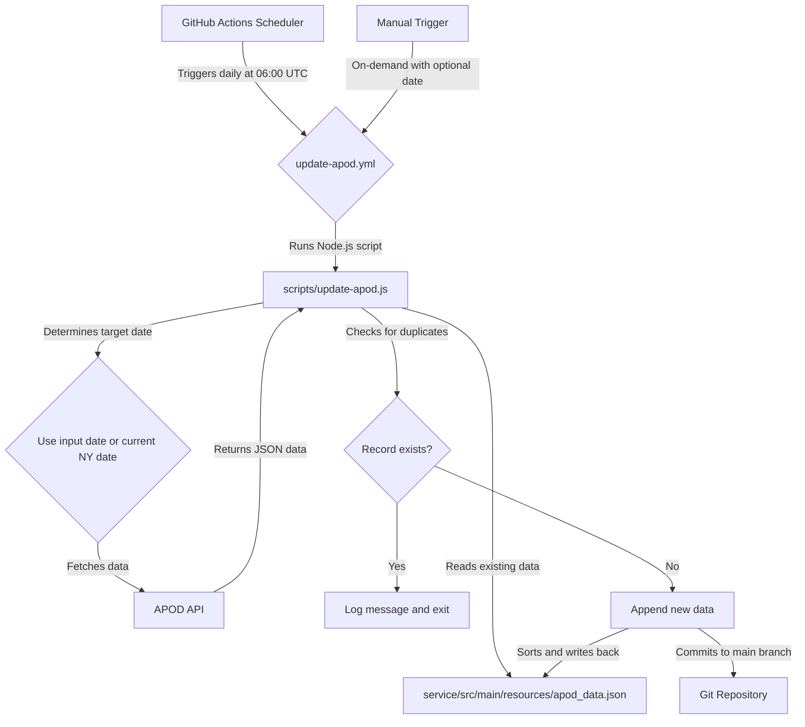

# Architecture

This document outlines the architecture of the APOD-Backend application.

## 1. Tech Stack

- **Java**: 17
- **Spring Boot**: 3.3.1
- **Build Tool**: Gradle
- **Caching**: Spring Data Redis
- **HTTP Client**: Spring WebFlux `WebClient`
- **Testing**: JUnit 5, Mockito

## 2. Project Structure

The project is now organized into two top-level modules:

- **`service/`**: This module contains all production application code, including:
    - All API implementations
    - Controllers/handlers
    - Business logic
    - Dependency injection/bootstrap code
    - Configuration required by runtime services
    - Existing production tests that belong with the service module
    The internal structure follows a standard layered architecture, organized by feature into the following packages:
    - `com.onfilm.apodbackend`: The root package.
        - `config`: Contains all Spring configuration classes (e.g., `WebClientConfig`, `NasaApiConfig`).
        - `controller`: Houses RESTful controllers that expose the application's API endpoints.
        - `dto`: Contains Data Transfer Objects used for API request/response bodies (e.g., `ApodResponse`).
        - `exception`: Defines custom exception classes for handling application-specific errors.
        - `model`: Domain entities for persistence.
        - `repository`: Spring Data repositories for database interaction.
        - `service`: Contains business logic and service layer classes (e.g., `NasaClient`).
        - `util`: Holds utility classes and helper methods.

- **`service-hermetic/`**: This module contains:
    - Hermetic/integration/end-to-end test suites
    - Test-only utilities
    - Test fixtures
    - Test environments
    - Mock infrastructure required only for hermetic testing
    - Any test runners or helpers specific to hermetic validation

## 3. Dependency Rules

- The `service` module must not depend on the `service-hermetic` module.
- The `service-hermetic` module may depend on the `service` module.

## 4. Testing Strategy

- **Unit Tests**: Located within the `service` module, these tests focus on individual components in isolation.
- **Integration Tests**: These tests verify the interaction between multiple components within the `service` module.
- **Hermetic Tests**: Located within the `service-hermetic` module, these are comprehensive integration/end-to-end test suites that validate the entire application in an isolated environment.

## 5. External API Integration

- **NASA APOD API**: The application integrates with the NASA "Astronomical Picture of the Day" API to fetch data.
  - **Configuration**: The API key and base URL are managed in `application.properties` and loaded via the `NasaApiConfig` class.
  - **Client**: The `NasaClient` service uses a non-blocking `WebClient` to communicate with the API.

## 6. Caching Strategy

- **Provider**: Redis will be used as the caching provider.
- **Implementation**: A caching layer will be added to the service to store and retrieve APOD data, reducing redundant calls to the NASA API.

## 7. Automated Data Updates

This section describes the architecture of the automated APOD data update system.

### Data Flow

The following diagram illustrates the data flow from the APOD API to the `apod_data.json` file in the repository.

### Failure Recovery Flow

The system is designed to be resilient and recoverable:

1.  **API Failure:** The `update-apod.js` script includes a retry mechanism with exponential backoff. If the APOD API is temporarily unavailable, the script will attempt to fetch the data multiple times before failing.
2.  **Workflow Failure:** If a scheduled daily run fails, a user can manually trigger the workflow for the missed date.
3.  **Manual Backfill:** To backfill a missing date, a user can run the workflow manually and provide the specific date in the `YYYY-MM-DD` format. The script's idempotent design ensures that providing a date that already exists will not result in duplicate entries.

### GitHub Actions Lifecycle

1.  **Trigger:** The workflow is triggered either by the cron schedule or a manual dispatch.
2.  **Checkout:** The repository code is checked out.
3.  **Setup Node.js:** A Node.js environment is prepared.
4.  **Execute Script:** The `scripts/update-apod.js` script is executed.
    - The script determines the target date.
    - It fetches data from the APOD API.
    - It reads the existing `service/src/main/resources/apod_data.json` file.
    - It checks for duplicates and appends the new data if it's not a duplicate.
    - It writes the updated data back to the file.
    - It sets an output `changed` to `true` or `false`.
5.  **Commit:** If the `changed` output is `true`, the workflow commits the updated `service/src/main/resources/apod_data.json` file to the `main` branch with a conventional commit message. If `false`, this step is skipped.

## 8. Build and Deployment Flow

### Local Development
- Developers can run the `service` module directly using Spring Boot's run configurations or by executing `./gradlew :service:bootRun` from the project root.

### CI Flow
- **Build**: The CI pipeline will execute `./gradlew build` to build all modules.
- **Test**: Unit tests for the `service` module (`./gradlew :service:test`) and hermetic tests for the `service-hermetic` module (`./gradlew :service-hermetic:test`) will be run.
- **Artifacts**: Deployable JARs will be generated from the `service` module.

### Release Flow
- The release pipeline will build the `service` module and create deployable artifacts, ensuring that only production code is included in the final release.
